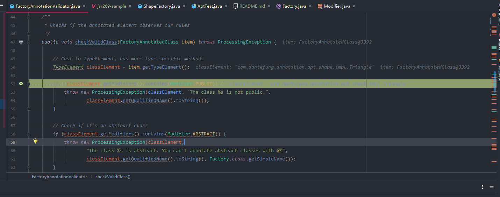
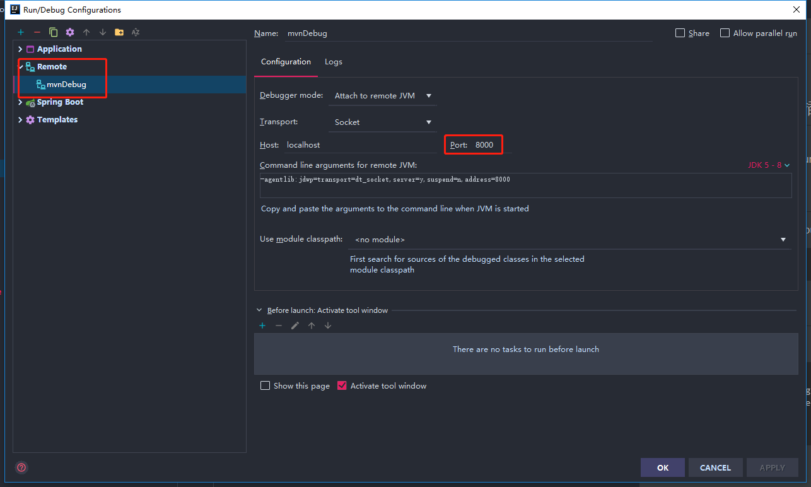
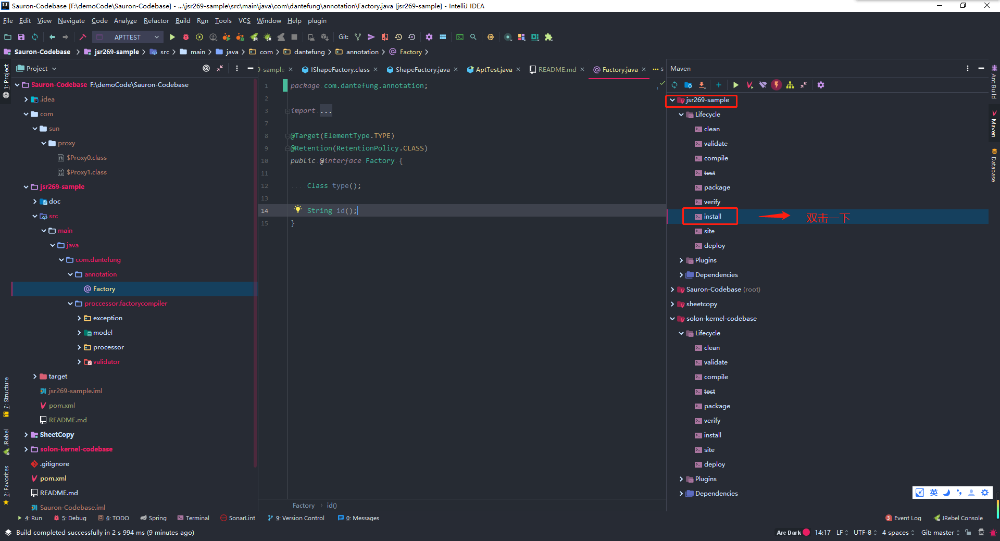
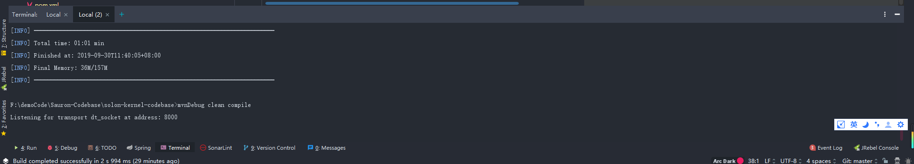
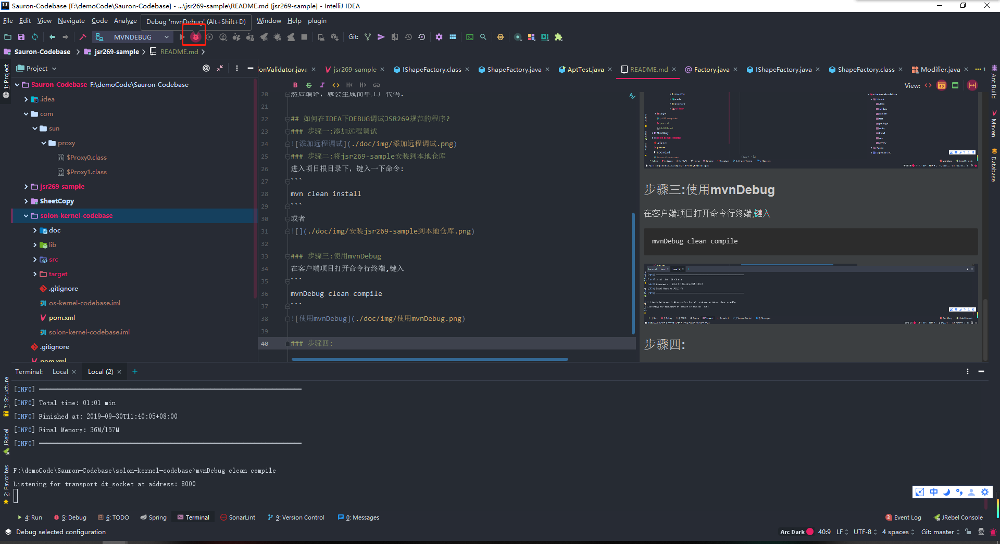
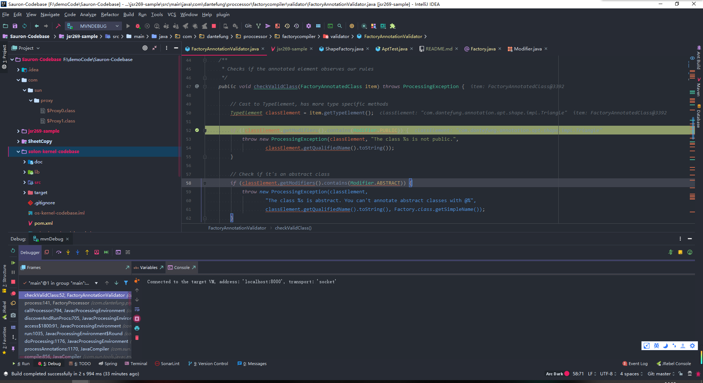

## 背景
用于编译时期生成简单工厂代码.
一个形状的接口IShape，并为其添加 draw()方法:
```
public interface IShape {
	void draw();
}
```
接下来定义几个形状实现IShape接口,并重写draw()方法:
```
public class Rectangle implements IShape {
	@Override
	public void draw() {
		System.out.println("Draw a Rectangle");
	}
}

public class Triangle implements IShape {
	@Override
	public void draw() {
		System.out.println("Draw a Triangle");
	}
}

public class Circle implements IShape {  
    @Override
    public void draw() {   
        System.out.println("Draw a circle");
    }
}
```
接下来我们需要一个工厂类，这个类接收一个参数，根据我们传入的参数创建出对应的形状，代码如下：
```
public class ShapeFactory {
  public Shape create(String id) {
    if (id == null) {
      throw new IllegalArgumentException("id is null!");
    }
    if ("Circle".equals(id)) {
      return new Circle();
    }
    if ("Rectangle".equals(id)) {
      return new Rectangle();
    }
    if ("Triangle".equals(id)) {
      return new Triangle();
    }
    throw new IllegalArgumentException("Unknown id = " + id);
  }
}
```
以上就是一个简单工厂模式的示例代码，想必大家都能够理解。
那么，现在问题来了，在项目开发过程中，我们随时可能会添加一个新的形状。
此时就不得不修改工厂类来适配新添加的形状了。试想一下，
每添加一个形状类都需要我们手动去更新Factory类，是不是影响了我们的开发效率？
如果这个Factory类能够根据我们添加新的形状来同步更新Factory代码，
岂不是就省了我们很多时间了吗？

## 必要知识
- [AutoService](https://github.com/google/auto/tree/master/service) 库，编译时自动帮我们把META-INF/services下的配置文件生成，不用人工维护.
- [JCP:JSR 269 Pluggable Annotation Processing](https://jcp.org/aboutJava/communityprocess/final/jsr269/index.html)

### 插件化注解处理(Pluggable Annotation Processing)API 
> JSR 269提供一套标准API来处理AnnotationsJSR 175,实际上JSR 269不仅仅用来处理Annotation，我觉得更强大的功能是它建立了Java 语言本身的一个模型,它把method、package、constructor、type、variable、enum、annotation等Java语言元素映射为Types和Elements，从而将Java语言的语义映射成为对象，我们可以在javax.lang.model包下面可以看到这些类。所以我们可以利用JSR 269提供的API来构建一个功能丰富的元编程(metaprogramming)环境。JSR 269用Annotation Processor在编译期间而不是运行期间处理Annotation, Annotation Processor相当于编译器的一个插件,所以称为插入式注解处理.如果Annotation Processor处理Annotation时(执行process方法)产生了新的Java代码，编译器会再调用一次Annotation Processor，如果第二次处理还有新代码产生，就会接着调用Annotation Processor，直到没有新代码产生为止。每执行一次process()方法被称为一个"round"，这样整个Annotation processing过程可以看作是一个round的序列。JSR 269主要被设计成为针对Tools或者容器的API。这个特性虽然在JavaSE 6已经存在，但是很少人知道它的存在。lombok就是使用这个特性实现编译期的代码插入的。另外，如果没有猜错，像IDEA在编写代码时候的标记语法错误的红色下划线也是通过这个特性实现的。KAPT(Annotation Processing for Kotlin)，也就是Kotlin的编译也是通过此特性的。

> Pluggable Annotation Processing API的核心是Annotation Processor即注解处理器，一般需要继承抽象类javax.annotation.processing.AbstractProcessor。注意，与运行时注解RetentionPolicy.RUNTIME不同，注解处理器只会处理编译期注解，也就是RetentionPolicy.SOURCE的注解类型，处理的阶段位于Java代码编译期间。

### JSR269 使用步骤
插件化注解处理API的使用步骤大概如下：

-[x] 1、自定义一个Annotation Processor，需要继承javax.annotation.processing.AbstractProcessor，并覆写process方法。

-[x] 2、自定义一个注解，注解的元注解需要指定@Retention(RetentionPolicy.SOURCE)。

-[x] 3、需要在声明的自定义Annotation Processor中使用javax.annotation.processing.SupportedAnnotationTypes指定在第2步创建的注解类型的名称(注意需要全类名，"包名.注解类型名称"，否则会不生效)。

-[x] 4、需要在声明的自定义Annotation Processor中使用javax.annotation.processing.SupportedSourceVersion指定编译版本。

-[x] 5、可选操作，可以通在声明的自定义Annotation Processor中使用javax.annotation.processing.SupportedOptions指定编译参数。

### 指定Processor方式
-[x] 1、直接使用编译参数指定，例如：javac -processor club.throwable.processor.AnnotationProcessor Main.java。
-[x] 2、通过服务注册指定，就是META-INF/services/javax.annotation.processing.Processor文件中添加club.throwable.processor.AnnotationProcessor。
-[x] 3、通过Maven的编译插件的配置指定如下:
```
    <plugin>
            <groupId>org.apache.maven.plugins</groupId>
            <artifactId>maven-compiler-plugin</artifactId>
            <version>3.5.1</version>
            <configuration>
                <source>1.8</source>
                <target>1.8</target>
                <encoding>UTF-8</encoding>
                <annotationProcessors>
                    <annotationProcessor>
                        club.throwable.processor.AnnotationProcessor
                    </annotationProcessor>
                </annotationProcessors>
            </configuration>
        </plugin>
```
值得注意的是，以上三点生效的前提是club.throwable.processor.AnnotationProcessor已经被编译过，否则编译的时候就会报错：
```
[ERROR] Bad service configuration file, or exception thrown while
constructing Processor object: javax.annotation.processing.Processor: 
Provider club.throwable.processor.AnnotationProcessor not found
```
解决方法有两种:

`第一种`是提前使用命令或者IDEA右键club.throwable.processor.AnnotationProcessor对它进行编译；

`第二种`是把club.throwable.processor.AnnotationProcessor放到一个独立的Jar包引入。

## 哪里使用到本jrs269插件化注解？
Sauron-Codebase\solon-kernel-codebase\src\main\java\com\dantefung\annotation\apt\shape包下的代码
## 安装
Compile and deploy this project to your local maven repository with:
```
mvn clean install
```
## 使用方法
如果客户端程序使用到了jsr269-sample内的@Factory注解,则在maven的pom文件中引入
```
 <dependency>
        <groupId>com.dantefung</groupId>
        <artifactId>jsr269-sample</artifactId>
        <version>1.0.0</version>
</dependency>
```
然后编译，就会生成简单工厂代码.

## 如何在IDEA下DEBUG调试JSR269规范的程序?
### 步骤一:打断点

### 步骤二:添加远程调试

### 步骤三:将jsr269-sample安装到本地仓库
进入项目根目录下，键入一下命令:
```
mvn clean install
```
或者


### 步骤四:使用mvnDebug
在客户端项目打开命令行终端,键入
```
mvnDebug clean compile
```


### 步骤五:debug启动远程调试




# 参考文献
- [ANNOTATION PROCESSING 101](http://hannesdorfmann.com/annotation-processing/annotationprocessing101)
- [Java编译时注解处理器（APT）详解](https://blog.csdn.net/qq_20521573/article/details/82321755)
- [Java奇技淫巧-插件化注解处理API(Pluggable Annotation Processing API)](https://www.cnblogs.com/throwable/p/9139908.html)