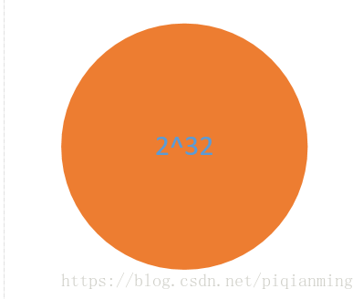

# 一致性哈希算法

## 1.概述
### 1.1 传统算法的缺陷 (硬哈希)
对于服务器分布，我们要考虑的东西有如下三点：数据平均分布，查找定位准确，降低宕机影响。

求余算法: hash(Key)%N              [ N：服务器数量 ]

> Note:
> 
>`同余定理`:
**简单来说，就是两个整数 a 和 b，如果它们除以正整数 m 得到的余数相等，我们就可以说 a 和 b 对于模 m 同余。**
>
>我们拿星期的例子来看。假如今天是星期一，从今天开始的 100 天里，都有多少个星期呢？你拿 100 除以 7，得到商 14 余 2，也就是说这 100 天里有 14 周多 2 天。换个角度看，我们可以说，这 100 天里，你的第 1 天、第 8 天、第 15 天等等，在余数的世界里都被认为是同一天，因为它们的余数都是 1，都是星期一，你要上班的日子。同理，第 2 天、第 9 天、第 16 天余数都是 2，它们都是星期二。
>
> **同余定理其实就是用来分类的.** 因为不管你的模是几，最终得到的余数肯定都在一个范围内。比如我们上面除以 7，就得到了星期几；我们除以 2，就得到了奇偶数。所以按照这种方式, 我们就可以把无穷多个整数分成有限多个类。
> 
> `哈希（Hash）`你应该不陌生，在每个编程语言中，都会有对应的哈希函数。哈希有的时候也会被翻译为散列，简单来说，它就是**将任意长度的输入，通过哈希算法，压缩为某一固定长度的输出.**
> 。这话听着是不是有点耳熟？我们上面的求余过程不就是在做这事儿吗？
> 
>
> 通过取余进行空间分配:
> 

使用一般的取余算法，操作很简单，计算数据分布计算量非常简单。但是存在一个致命缺陷，如果增加一台服务器或者减少一台服务器，带来的结果可能如下：

- 数据重排
- 数据失效

> 例如: 分布式系统中，假设有 n 个节点，传统方案使用 mod(key, n) 映射数据和节点。 
当扩容或缩容时(哪怕只是增减1个节点)，映射关系变为 mod(key, n+1) / mod(key, n-1)，绝大多数数据的映射关系都会失效。

那么有什么办法解决一般算法中节点失效引起的数据需要重排的问题呢？

### 1.2 一致性哈希(Consistent Hashing)
1997年，麻省理工学院(MIT)的 David Karger 等6个人发布学术论文《Consistent hashing and random trees: distributed caching protocols for relieving hot spots on the World Wide Web（一致性哈希和随机树：用于缓解万维网上热点的分布式缓存协议）》，对于 K 个关键字和 n 个槽位(分布式系统中的节点)的哈希表，增减槽位后，平均只需对 K/n 个关键字重新映射。

### 1.3 哈希指标

评估一个哈希算法的优劣，有如下指标，而一致性哈希全部满足：

- 均衡性(Balance)：将关键字的哈希地址均匀地分布在地址空间中，使地址空间得到充分利用，这是设计哈希的一个基本特性。
- 单调性(Monotonicity): 单调性是指当地址空间增大时，通过哈希函数所得到的关键字的哈希地址也能映射的新的地址空间，而不是仅限于原先的地址空间。或等地址空间减少时，也是只能映射到有效的地址空间中。简单的哈希函数往往不能满足此性质。
- 分散性(Spread): 哈希经常用在分布式环境中，终端用户通过哈希函数将自己的内容存到不同的缓冲区。此时，终端有可能看不到所有的缓冲，而是只能看到其中的一部分。当终端希望通过哈希过程将内容映射到缓冲上时，由于不同终端所见的缓冲范围有可能不同，从而导致哈希的结果不一致，最终的结果是相同的内容被不同的终端映射到不同的缓冲区中。这种情况显然是应该避免的，因为它导致相同内容被存储到不同缓冲中去，降低了系统存储的效率。分散性的定义就是上述情况发生的严重程度。好的哈希算法应能够尽量避免不一致的情况发生，也就是尽量降低分散性。
- 负载(Load): 负载问题实际上是从另一个角度看待分散性问题。既然不同的终端可能将相同的内容映射到不同的缓冲区中，那么对于一个特定的缓冲区而言，也可能被不同的用户映射为不同的内容。与分散性一样，这种情况也是应当避免的，因此好的哈希算法应能够尽量降低缓冲的负荷。

### 1.4 资料链接

原始论文《Consistent Hashing and Random Trees》链接如下：

[官方链接 - PDF 版本](https://kefeng.wang/images/consistent-hashing/consistent-hashing-and-random-trees.pdf)

相关论文《Web Caching with Consistent Hashing》链接如下：

[官方链接 - PDF 版本](http://www.cs.columbia.edu/~asherman/papers/cachePaper.pdf)

更多资料： 

- [WikiPedia - Consistent hashing](https://en.wikipedia.org/wiki/Consistent_hashing) 
- [codeproject - Consistent hashing](https://www.codeproject.com/articles/56138/consistent-hashing)

## 2.算法原理

### 2.1 公用哈希函数和环形hash空间
设计哈希函数 Hash(key)，要求取值范围为 [0, 2^32) 。
考虑通常的 hash 算法都是将 value 映射到一个 32 位的 key 值，也即是 0~2^32-1 次方的数值空间；我们可以将这个空间想象成一个首（ 0 ）尾（ 2^32-1 ）相接的圆环。数据和服务器都映射到这个圆环上。

### 2.1.1 公用哈希函数和哈希环
设计哈希函数 Hash(key)，要求取值范围为 [0, 2^32) 
各哈希值在上图 Hash 环上的分布：时钟12点位置为0，按顺时针方向递增，临近12点的左侧位置为2^32-1。

### 2.1.2 节点(Node)映射至哈希环
如图哈希环上的绿球所示，四个节点 Node A/B/C/D， 
其 IP 地址或机器名，经过同一个 Hash() 计算的结果，映射到哈希环上。

### 2.1.3 对象(Object)映射于哈希环
如图哈希环上的黄球所示，四个对象 Object A/B/C/D， 
其键值，经过同一个 Hash() 计算的结果，映射到哈希环上。

### 2.1.4 对象(Object)映射至节点(Node)
在对象和节点都映射至同一个哈希环之后，要确定某个对象映射至哪个节点， 
只需从该对象开始，沿着哈希环顺时针方向查找，找到的第一个节点，即是。 
可见，Object A/B/C/D 分别映射至 Node A/B/C/D。

## 2.2 删除节点
现实场景：服务器缩容时删除节点，或者有节点宕机。如下图，要删除节点 Node C： 
只会影响欲删除节点(Node C)与上一个(顺时针为前进方向)节点(Node B)与之间的对象，也就是 Object C， 
这些对象的映射关系，按照 2.1.4 的规则，调整映射至欲删除节点的下一个节点 Node D。 
其他对象的映射关系，都无需调整。 

## 2.3 增加节点
现实场景：服务器扩容时增加节点。比如要在 Node B/C 之间增加节点 Node X： 
只会影响欲新增节点(Node X)与上一个(顺时针为前进方向)节点(Node B)与之间的对象，也就是 Object C， 
这些对象的映射关系，按照 2.1.4 的规则，调整映射至新增的节点 Node X。 
其他对象的映射关系，都无需调整。 

## 2.4 虚拟节点
对于前面的方案，节点数越少，越容易出现节点在哈希环上的分布不均匀，导致各节点映射的对象数量严重不均衡(数据倾斜)；相反，节点数越多越密集，数据在哈希环上的分布就越均匀。 
但实际部署的物理节点有限，我们可以用有限的物理节点，虚拟出足够多的虚拟节点(Virtual Node)，最终达到数据在哈希环上均匀分布的效果： 
如下图，实际只部署了2个节点 Node A/B， 
每个节点都复制成3倍，结果看上去是部署了6个节点。 
可以想象，当复制倍数为 2^32 时，就达到绝对的均匀，通常可取复制倍数为32或更高。 
虚拟节点哈希值的计算方法调整为：对“节点的IP(或机器名)+虚拟节点的序号(1~N)”作哈希。

## 参考文献
https://blog.csdn.net/kefengwang/article/details/81628977

