# 内存屏障

# 一、缘起
## 基础
### CPU结构

### CPU性能优化手段 - 缓存

### CPU性能优化手段 - 运行时指令重排序

# 二、两个问题

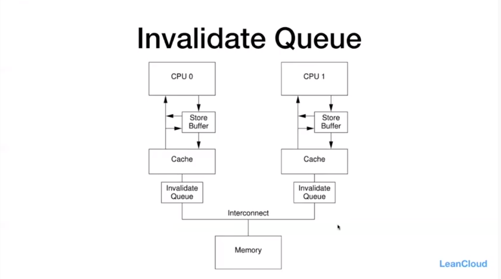
简化版本的MESI,一种CPU架构下的一个例子。写程序不能往这个套。

# 三、内存屏障的种类

# 四、Java Memory Model(JMM)
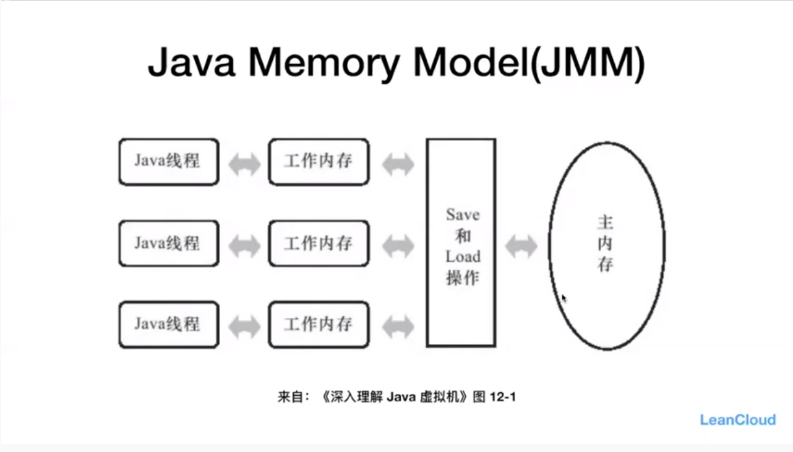
X86或ARM上的虚拟机抽象出一套共用的模型。
Java线程: 会被CPU执行，所以对应CPU。
工作内存: 对应Cache。  
Save和Load操作: 缓存一致性操作主存。

## JVM的内存屏障种类(JVM Barrier)

禁止重排.也不是完全不能重排，只是有条件:volatile写入不往前排，volatile读不往后排。

|屏障类型|指令示例|说明|
|----|----|----|
|LoadLoad Barriers|Load1;LoadLoad;Load2|确保Load1数据的装载先于Load2及所有后续装载指令的装载|
|StoreStore Barriers|Store1;StoreStore;Store2|确保Store1数据对其他处理器可见(刷到内存)先于Store2及所有后续存储指令的存储|
|LoadStore Barriers|Load1;LoadStore;Store2|确保Load1数据先装载于Store2及所有后续的存储指令的刷新到内存|
|StoreLoad Barriers|Store1;StoreLoad;Load2|确保Store1数据对其他处理器变得可见(指刷新到内存)先于Load2及后续所有装载指令的装载|

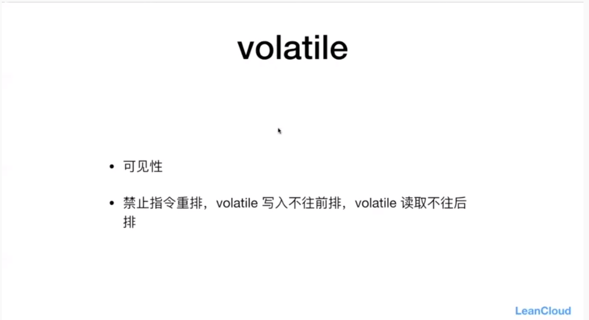
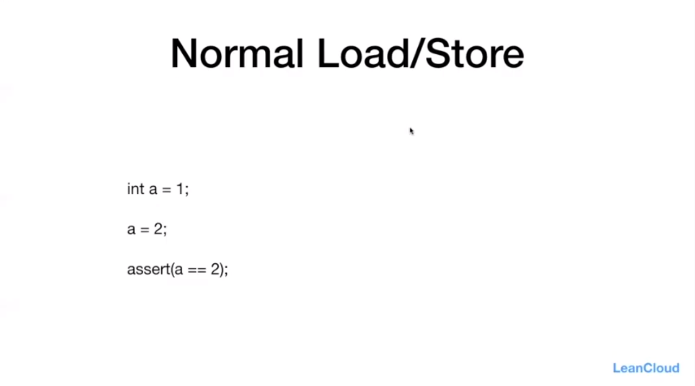
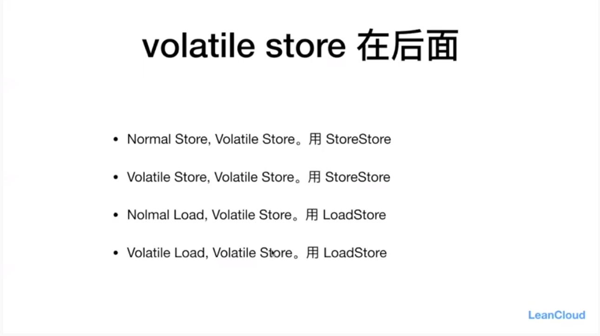
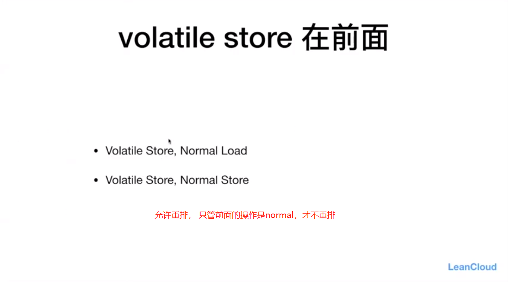
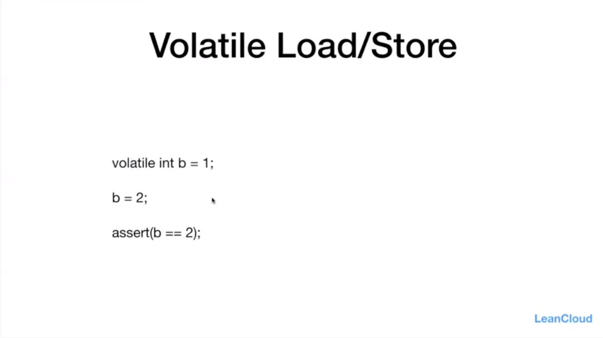
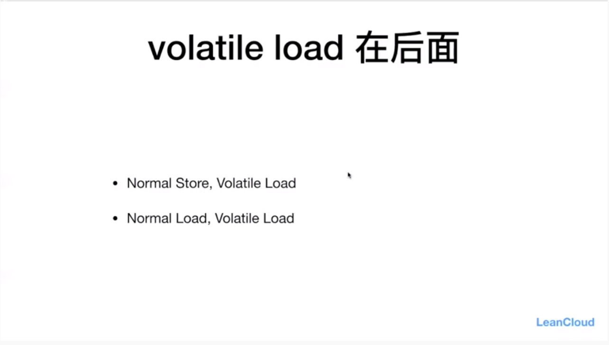
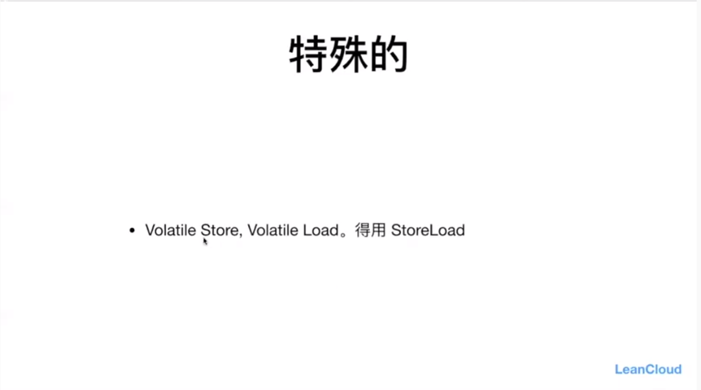
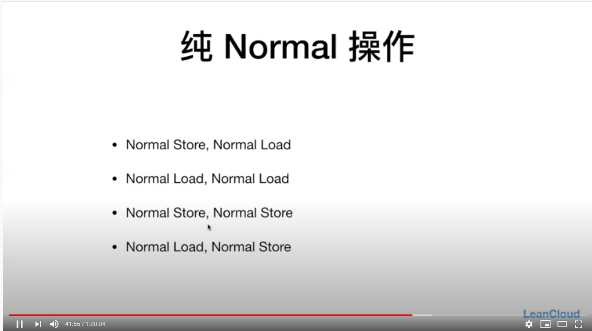
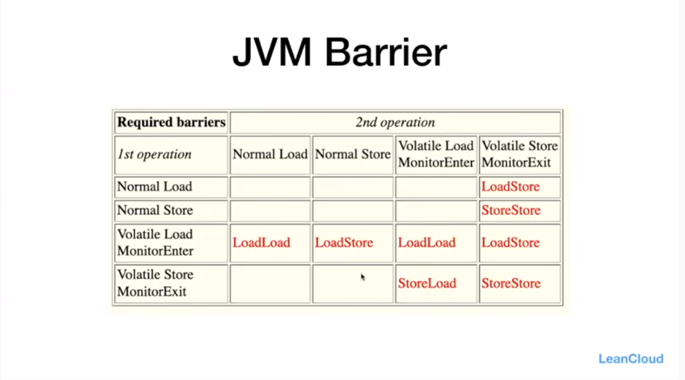
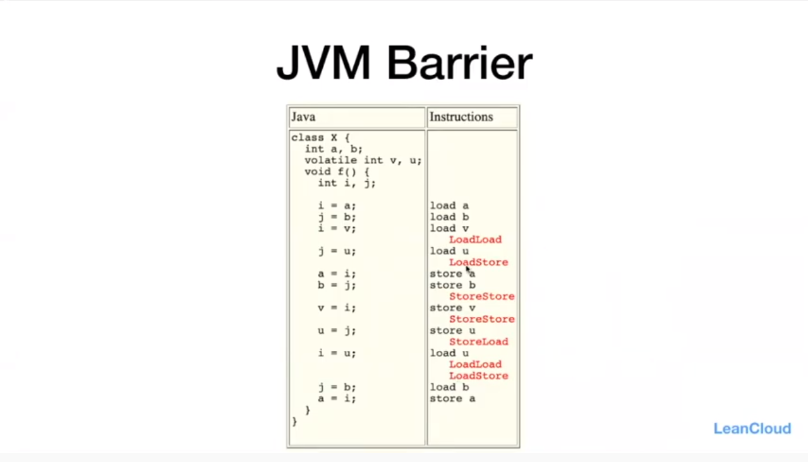
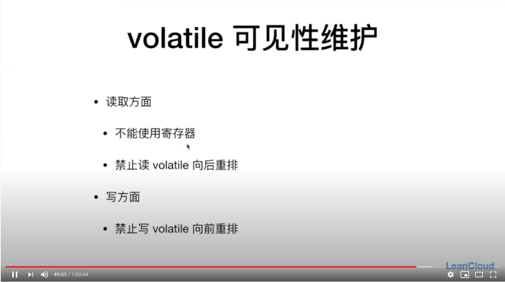

