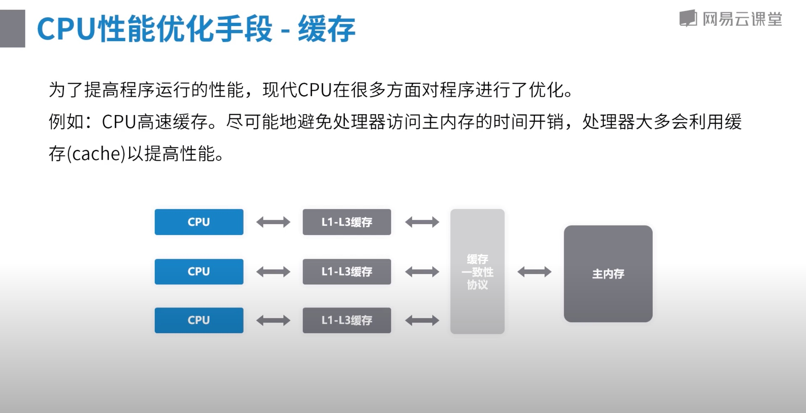
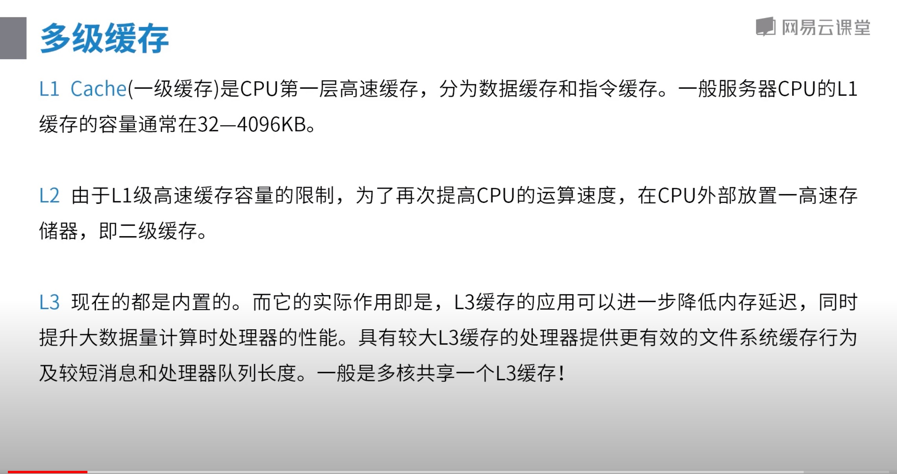
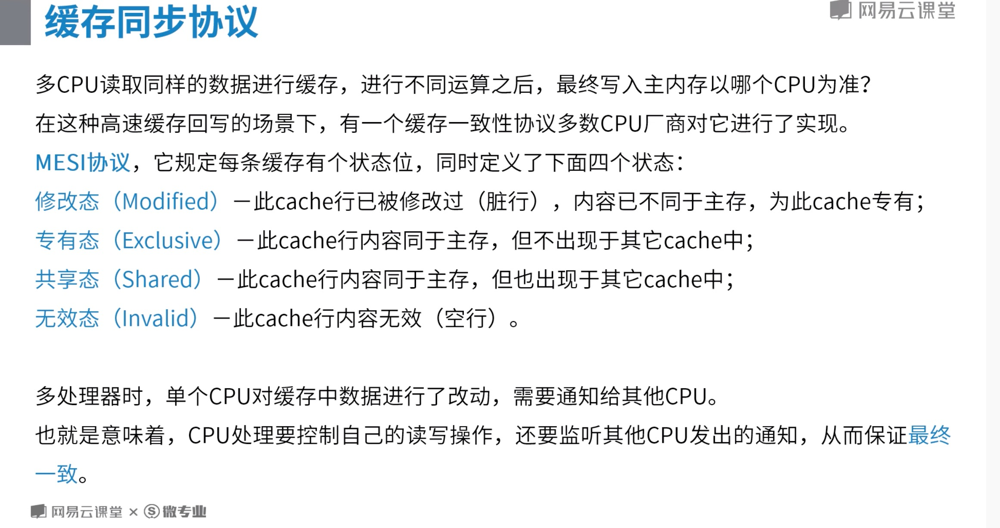
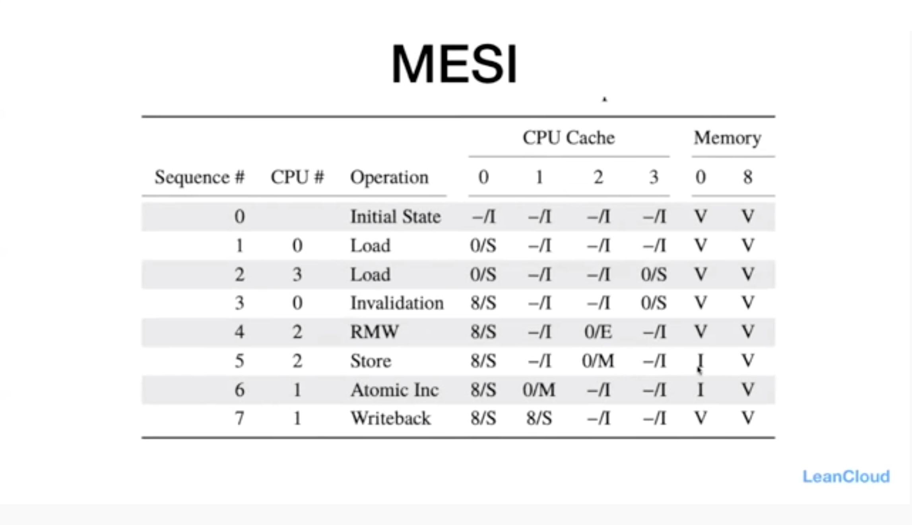
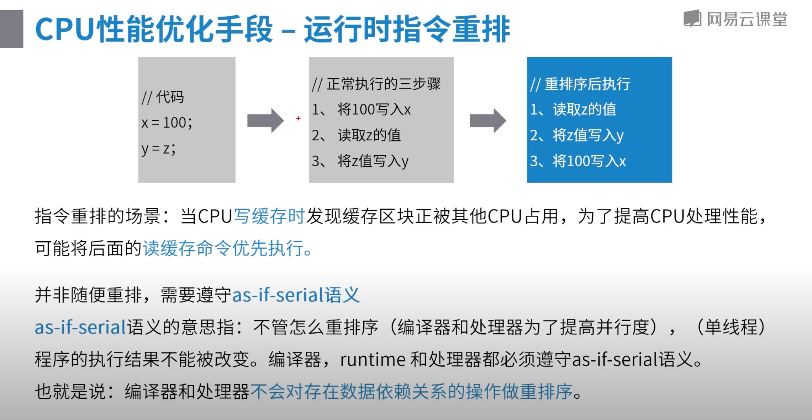
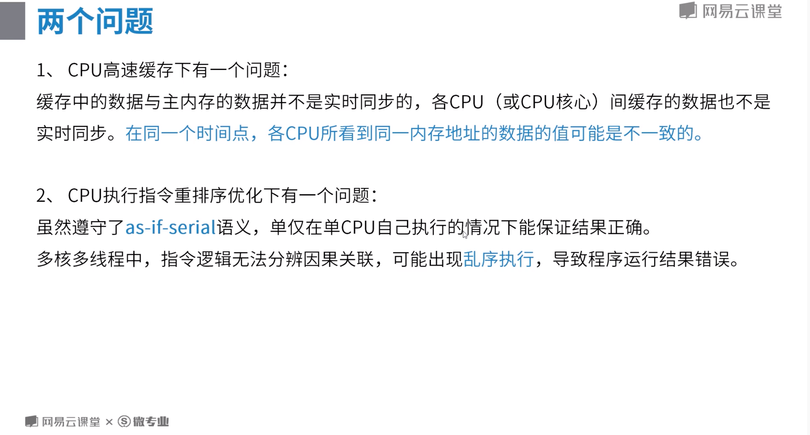
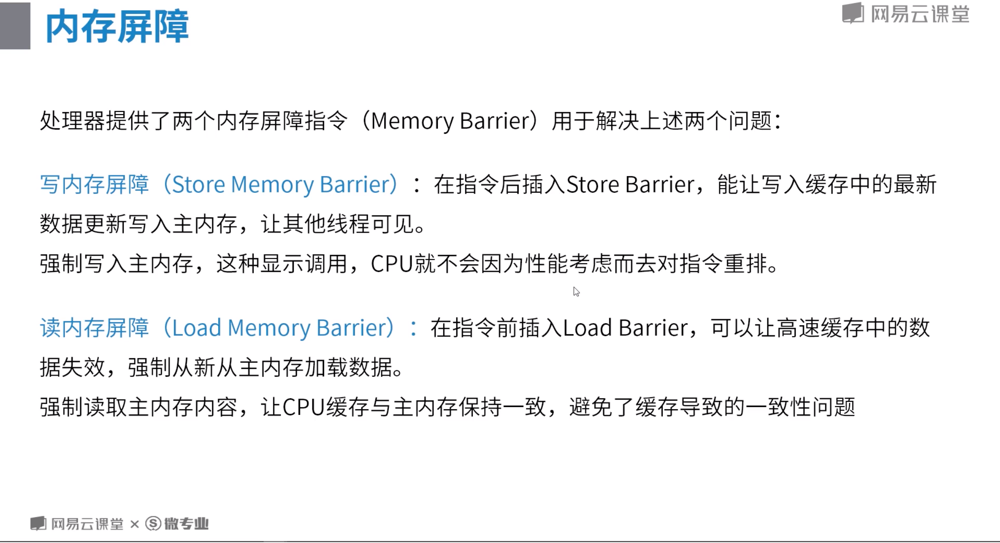

# 内存屏障

# 一、缘起
## 基础
### CPU结构

### CPU性能优化手段 - 缓存

### CPU性能优化手段 - 运行时指令重排序

# 二、两个问题

# 三、内存屏障的种类
|屏障类型|指令示例|说明|
|----|----|----|
|LoadLoad Barriers|Load1;LoadLoad;Load2|确保Load1数据的装载先于Load2及所有后续装载指令的装载|
|StoreStore Barriers|Store1;StoreStore;Store2|确保Store1数据对其他处理器可见(刷到内存)先于Store2及所有后续存储指令的存储|
|LoadStore Barriers|Load1;LoadStore;Store2|确保Load1数据先装载于Store2及所有后续的存储指令的刷新到内存|
|StoreLoad Barriers|Store1;StoreLoad;Load2|确保Store1数据对其他处理器变得可见(指刷新到内存)先于Load2及后续所有装载指令的装载|