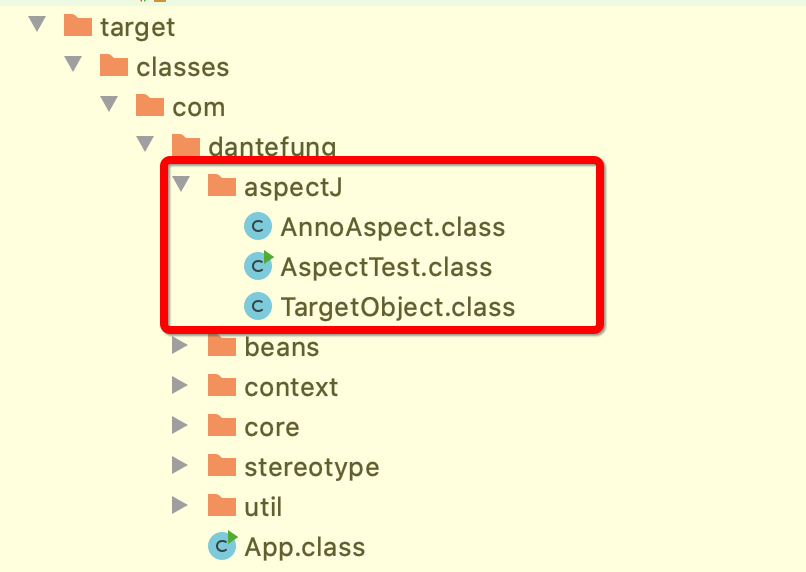
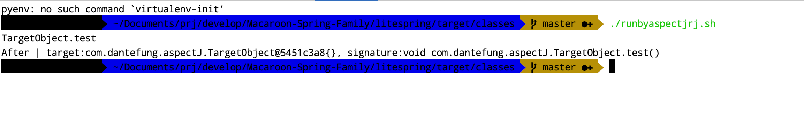

## 赋予脚本执行权限
``` 
chmod +x incompileweaver.sh
chmod +x runbyaspectjrj.sh
```

## incompileweaver.sh
Sauron-Codebase/solon-kernel-codebase/src/main/java/com/dantefung/dp/proxy/apsectJ目录下，执行如下命令：
``` 
./incompileweaver.sh
```
效果:

``` 
//
// Source code recreated from a .class file by IntelliJ IDEA
// (powered by Fernflower decompiler)
//

package com.dantefung.aspectJ;

import org.aspectj.lang.JoinPoint;
import org.aspectj.lang.NoAspectBoundException;
import org.aspectj.lang.annotation.After;
import org.aspectj.lang.annotation.Aspect;

@Aspect
public class AnnoAspect {
    public AnnoAspect() {
    }

    @After("execution(* com.dantefung.aspectJ.TargetObject.*(..))")
    public void afterDo(JoinPoint joinPoint) {
        System.out.println("After | target:" + joinPoint.getTarget() + "{}, signature:" + joinPoint.getSignature());
    }

    public static AnnoAspect aspectOf() {
        if (ajc$perSingletonInstance == null) {
            throw new NoAspectBoundException("com.dantefung.aspectJ.AnnoAspect", ajc$initFailureCause);
        } else {
            return ajc$perSingletonInstance;
        }
    }

    public static boolean hasAspect() {
        return ajc$perSingletonInstance != null;
    }

    static {
        try {
            ajc$postClinit();
        } catch (Throwable var1) {
            ajc$initFailureCause = var1;
        }

    }
}

```

``` 
//
// Source code recreated from a .class file by IntelliJ IDEA
// (powered by Fernflower decompiler)
//

package com.dantefung.aspectJ;

import org.aspectj.lang.JoinPoint;
import org.aspectj.runtime.reflect.Factory;

public class TargetObject {
    public TargetObject() {
    }

    public void test() {
        JoinPoint var1 = Factory.makeJP(ajc$tjp_0, this, this);

        try {
            System.out.println("TargetObject.test");
        } catch (Throwable var3) {
            AnnoAspect.aspectOf().afterDo(var1);
            throw var3;
        }

        AnnoAspect.aspectOf().afterDo(var1);
    }

    static {
        ajc$preClinit();
    }
}

```


## runbyaspectjrj.sh
Sauron-Codebase/solon-kernel-codebase/target/classes目录下放入runbyaspectjrj.sh，并执行如下命令:
``` 
./runbyaspectjrj.sh 
```
效果:
