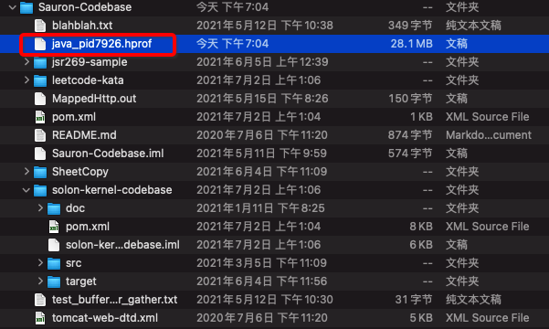
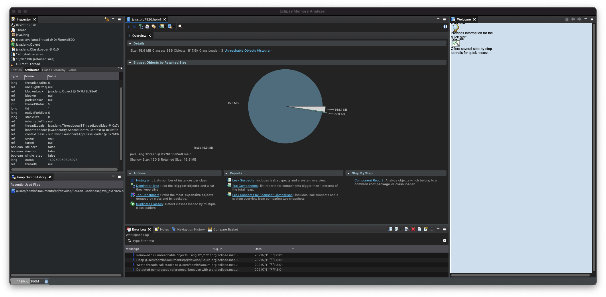

## 实验: java堆溢出

## 限制java堆大小位20MB

```
-Xms20m -Xmx20m -XX:+HeapDumpOnOutOfMemoryError
```

**参数说明:**

Xms:设置堆的最小空间大小。

Xmx:设置堆的最大空间大小。

-XX:+HeapDumpOnOutOfMemoryError 让虚拟机在出现内存溢出异常时Dump出当前内存堆转存储快照以便事后进行分析。



## Eclipse Memory Analyzer


